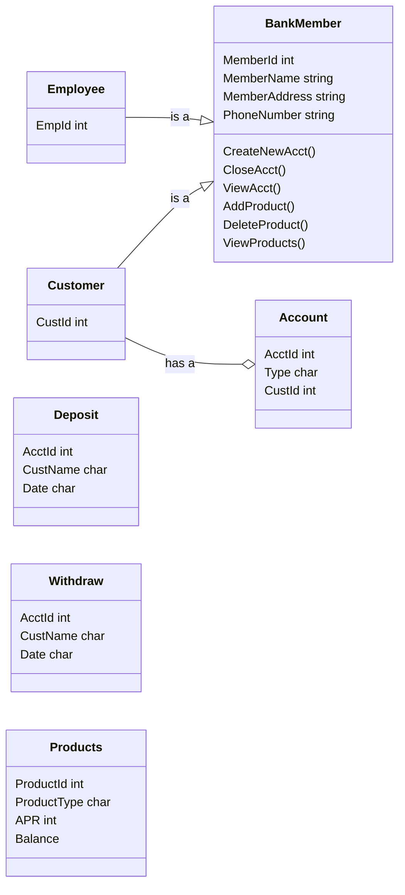

```mermaid
classDiagram
direction LR
BankMember
BankMember : MemberId int
BankMember : MemberName string
BankMember : MemberAddress string
BankMember : PhoneNumber string
BankMember : CreateNewAcct()
BankMember: CloseAcct()
BankMember : ViewAcct()
BankMember : AddProduct()
BankMember : DeleteProduct()
BankMember : ViewProducts()

Employee --|> BankMember : is a
Employee : EmpId int

Customer --|> BankMember : is a
Customer --o Account : has a
Customer : CustId int

Account
Account : AcctId int
Account : Type char
Account : CustId int

Deposit
Deposit : AcctId int
Deposit : CustName char
Deposit : Date char

Withdraw
Withdraw : AcctId int
Withdraw : CustName char
Withdraw : Date char


Products : ProductId int
Products : ProductType char
Products : APR int
Products : Balance


```
