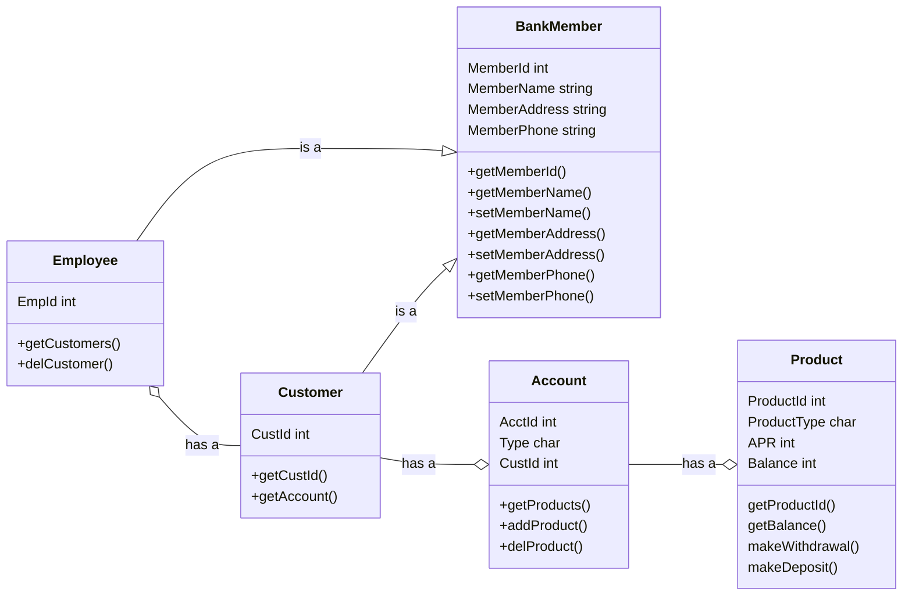

```mermaid
classDiagram
direction LR
BankMember
BankMember : MemberId int
BankMember : MemberName string
BankMember : MemberAddress string
BankMember : MemberPhone string
BankMember : +getMemberId()
BankMember : +getMemberName()
BankMember : +setMemberName()
BankMember : +getMemberAddress()
BankMember : +setMemberAddress()
BankMember : +getMemberPhone()
BankMember : +setMemberPhone()


Employee --|> BankMember : is a
Employee o-- Customer : has a
Employee : EmpId int
Employee : +getCustomers()
Employee : +delCustomer()

Customer --|> BankMember : is a
Customer --o Account : has a
Customer : CustId int
Customer : +getCustId()
Customer : +getAccount()

Account --o Product : has a
Account : AcctId int
Account : Type char
Account : CustId int
Account : +getProducts()
Account : +addProduct()
Account : +delProduct()


Product : ProductId int
Product : ProductType char
Product : APR int
Product : Balance int
Product : getProductId()
Product : getBalance()
Product : makeWithdrawal()
Product : makeDeposit()

```
