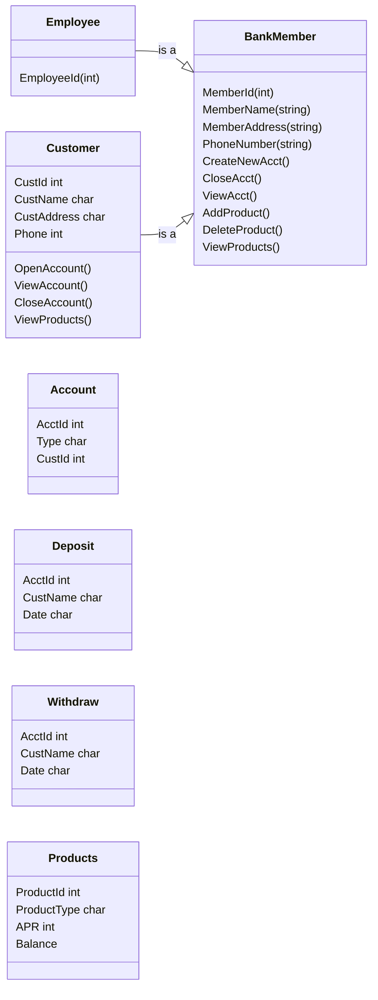

```mermaid
classDiagram
direction LR
BankMember
BankMember : MemberId(int)
BankMember : MemberName(string)
BankMember : MemberAddress(string)
BankMember : PhoneNumber(string)
BankMember : CreateNewAcct()
BankMember: CloseAcct()
BankMember : ViewAcct()
BankMember : AddProduct()
BankMember : DeleteProduct()
BankMember : ViewProducts()

Employee --|> BankMember : is a
Employee : EmployeeId(int)

Customer --|> BankMember : is a
Customer : CustId int
Customer : CustName char
Customer : CustAddress char
Customer : Phone int
Customer : OpenAccount()
Customer : ViewAccount()
Customer : CloseAccount()
Customer : ViewProducts()

Account
Account : AcctId int
Account : Type char
Account : CustId int

Deposit
Deposit : AcctId int
Deposit : CustName char
Deposit : Date char

Withdraw
Withdraw : AcctId int
Withdraw : CustName char
Withdraw : Date char


Products : ProductId int
Products : ProductType char
Products : APR int
Products : Balance


```
