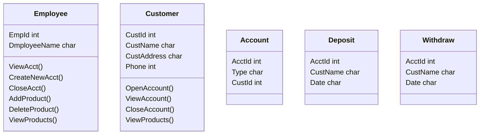

```mermaid
classDiagram
Employee 
Employee : EmpId int
Employee : DmployeeName char
Employee : ViewAcct()
Employee : CreateNewAcct()
Employee : CloseAcct()
Employee : AddProduct()
Employee : DeleteProduct()
Employee : ViewProducts()

Customer
Customer : CustId int
Customer : CustName char
Customer : CustAddress char
Customer : Phone int
Customer : OpenAccount()
Customer : ViewAccount()
Customer : CloseAccount()
Customer : ViewProducts()

Account
Account : AcctId int
Account : Type char
Account : CustId int

Deposit
Deposit : AcctId int
Deposit : CustName char
Deposit : Date char

Withdraw
Withdraw : AcctId int
Withdraw : CustName char
Withdraw : Date char
```
