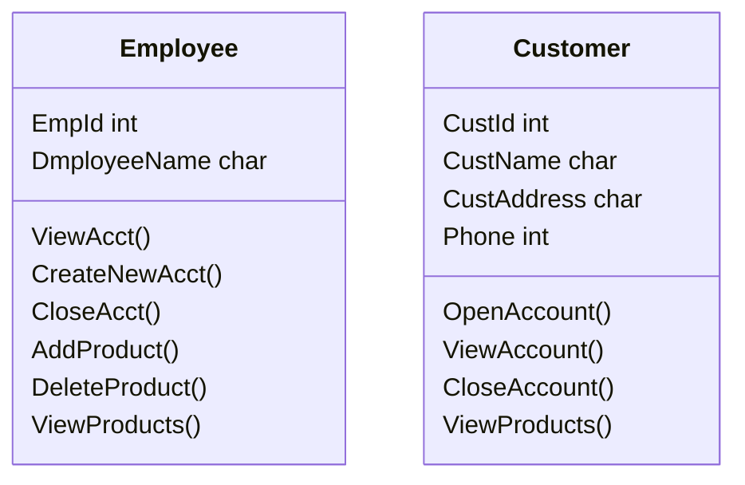

```mermaid
classDiagram
Employee 
Employee : EmpId int
Employee : DmployeeName char
Employee : ViewAcct()
Employee : CreateNewAcct()
Employee : CloseAcct()
Employee : AddProduct()
Employee : DeleteProduct()
Employee : ViewProducts()

Customer
Customer : CustId int
Customer : CustName char
Customer : CustAddress char
Customer : Phone int
Customer : OpenAccount()
Customer : ViewAccount()
Customer : CloseAccount()
Customer : ViewProducts()
```
