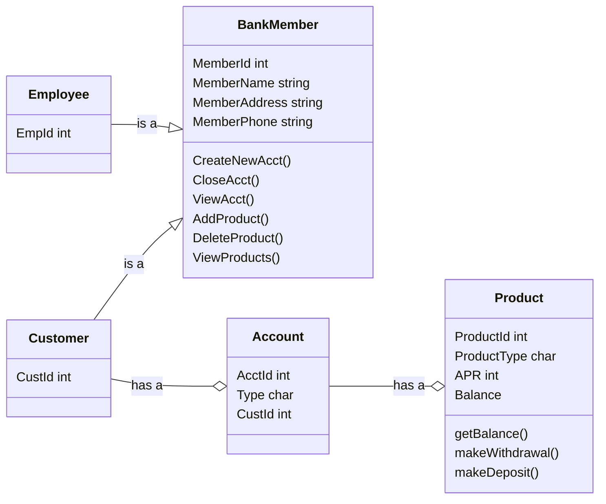

```mermaid
classDiagram
direction LR
BankMember
BankMember : MemberId int
BankMember : MemberName string
BankMember : MemberAddress string
BankMember : MemberPhone string
BankMember : CreateNewAcct()
BankMember: CloseAcct()
BankMember : ViewAcct()
BankMember : AddProduct()
BankMember : DeleteProduct()
BankMember : ViewProducts()

Employee --|> BankMember : is a
Employee : EmpId int

Customer --|> BankMember : is a
Customer --o Account : has a
Customer : CustId int

Account --o Product : has a
Account : AcctId int
Account : Type char
Account : CustId int

Product : ProductId int
Product : ProductType char
Product : APR int
Product : Balance
Product : getBalance()
Product : makeWithdrawal()
Product : makeDeposit()

```
